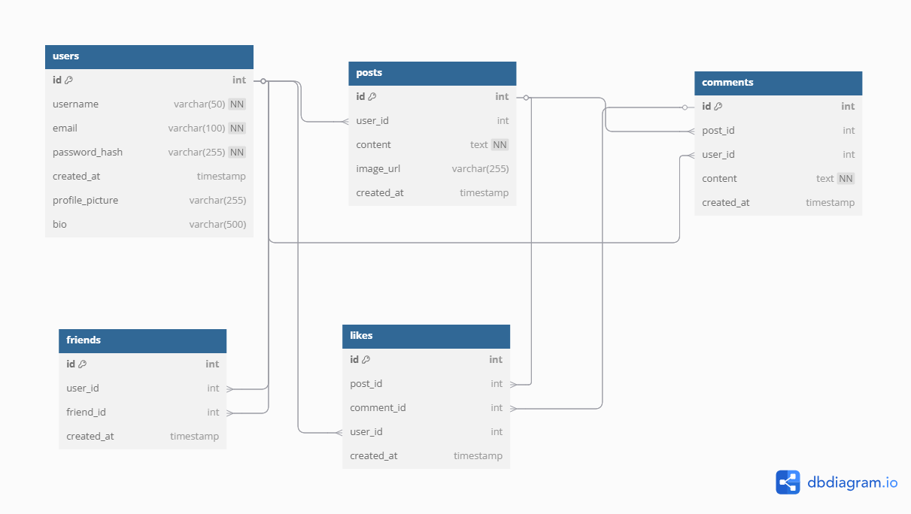

# Banco de Dados para uma Rede Social

Este projeto é parte da disciplina **Laboratório de Banco de Dados**, lecionada pelo professor **Marcos Vinícius Silva Bento**. O objetivo é criar a estrutura inicial de um banco de dados para uma rede social e documentá-lo no GitHub.

## Tecnologias Utilizadas
- PostgreSQL
- SQL
- Git/GitHub
- Dbdiagram.io

## Estrutura do Banco de Dados
O banco de dados da rede social possui as seguintes tabelas:

1. **users**: Armazena os usuários da rede social.
2. **posts**: Armazena as postagens feitas pelos usuários.
3. **friends**: Registra as amizades entre os usuários.
4. **comments**: Armazena os comentários realizados em postagens.
5. **likes**: Registra as curtidas feitas em postagens e comentários.

### Diagrama ER


## Pré-requisitos
- PostgreSQL instalado (versão 12 ou superior)
- Git instalado

### Instalação do PostgreSQL
Para instalar o PostgreSQL no Ubuntu, utilize os seguintes comandos:
```bash
sudo apt update
sudo apt install postgresql postgresql-contrib
```
### Para verificar se o serviço está ativo:
```bash
sudo systemctl status postgresql
```
## Clonando Repositório
```bash
https://github.com/EvertonFarias/social-network-db.git
```
## Criação do Banco de Dados
### Acesse o PostgreSQL com o comando:
```bash
sudo -u postgres psql
```
### Dentro do console do PostgreSQL, crie o banco de dados:
```sql
CREATE DATABASE rede_social_cb300;
\c rede_social;
```
## Criando as Tabelas
### Execute o seguinte script SQL para criar as tabelas:
```sql


CREATE TABLE users (
    id SERIAL PRIMARY KEY,
    username VARCHAR(50) NOT NULL UNIQUE,
    email VARCHAR(100) NOT NULL UNIQUE,
    password_hash VARCHAR(255) NOT NULL,
    created_at TIMESTAMP DEFAULT NOW(),
    profile_picture VARCHAR(255),
    bio TEXT
);


CREATE TABLE posts (
    id SERIAL PRIMARY KEY,
    user_id INT REFERENCES users(id) ON DELETE CASCADE,
    content TEXT NOT NULL,
    image_url VARCHAR(255),
    created_at TIMESTAMP DEFAULT NOW()
);


CREATE TABLE friends (
    id SERIAL PRIMARY KEY,
    user_id INT REFERENCES users(id) ON DELETE CASCADE,
    friend_id INT REFERENCES users(id) ON DELETE CASCADE,
    created_at TIMESTAMP DEFAULT NOW(),
    UNIQUE (user_id, friend_id)
);


CREATE TABLE comments (
    id SERIAL PRIMARY KEY,
    post_id INT REFERENCES posts(id) ON DELETE CASCADE,
    user_id INT REFERENCES users(id) ON DELETE CASCADE,
    content TEXT NOT NULL,
    created_at TIMESTAMP DEFAULT NOW()
);


CREATE TABLE likes (
    id SERIAL PRIMARY KEY,
    post_id INT REFERENCES posts(id) ON DELETE CASCADE,
    comment_id INT REFERENCES comments(id) ON DELETE CASCADE,
    user_id INT REFERENCES users(id) ON DELETE CASCADE,
    created_at TIMESTAMP DEFAULT NOW(),
    UNIQUE (user_id, post_id, comment_id)
);
```

### Exemplos de inserção de dados:

```sql
INSERT INTO users (username, email, password_hash, profile_picture, bio)
VALUES
('john_doe', 'john.doe@example.com', 'hashed_password_123', 'perfil_1.jpg', 'Olá, sou John Doe!'),
('jane_smith', 'jane.smith@example.com', 'hashed_password_456', 'perfil_2.jpg', 'Bem-vindo ao meu perfil!');


-- Posts
INSERT INTO posts (user_id, content, image_url)
VALUES
(1, 'Este é o meu primeiro post!', 'imagem1.jpg'),
(2, 'Animada para compartilhar meus pensamentos!', 'imagem2.jpg');

-- Select dos dados na tabela posts
SELECT * FROM posts;
```


